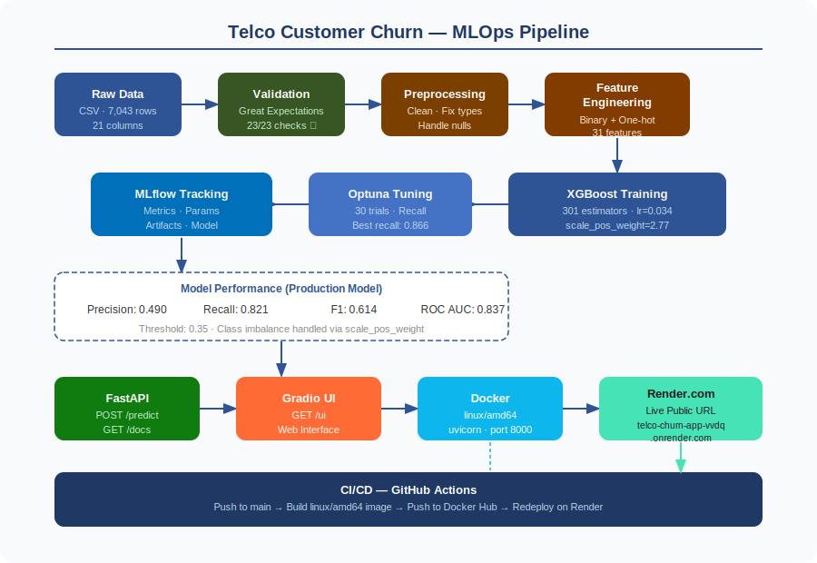

# Telco Churn — End-to-End MLOps Project

## Pipeline Overview



---

## Purpose

Build and ship a full machine-learning solution for predicting customer churn in a telecom setting — from data prep and modelling to a REST API and web UI deployed on Render.com.

---

## Problem Solved & Benefits

- **Faster decisions** — Predicts which customers are likely to churn so retention teams can act before they leave.
- **Operationalised ML** — Model is accessible via a REST API and a simple web UI; anyone can test it without touching a notebook.
- **Repeatable delivery** — CI/CD + containers mean every change can be rebuilt, tested, and redeployed consistently.
- **Traceable experiments** — MLflow tracks every run, its metrics, parameters, and artifacts for full reproducibility.

---

## What I Built

| Component | Details |
|-----------|---------|
| **Data Validation** | Great Expectations — 23/23 checks on schema, business logic, and numeric ranges |
| **Preprocessing** | Column cleaning, TotalCharges coercion, Churn → 0/1 mapping |
| **Feature Engineering** | 5 binary encoded + 21 one-hot encoded + 5 numeric = 31 features |
| **Model** | XGBoost classifier with `scale_pos_weight` for class imbalance |
| **Hyperparameter Tuning** | Optuna — 30 trials optimising recall |
| **Experiment Tracking** | MLflow — metrics, params, model artifacts logged per run |
| **Inference Service** | FastAPI exposing `POST /predict` and `GET /` health check |
| **Web UI** | Gradio interface mounted at `/ui` for manual testing |
| **Containerisation** | Docker image built for `linux/amd64` with uvicorn on port 8000 |
| **Deployment** | Render.com — live public URL via Docker Hub image |
| **CI/CD** | GitHub Actions — build → push to Docker Hub → redeploy on Render |

---

## Model Performance

| Metric | Value |
|--------|-------|
| Precision (Churn) | 0.490 |
| Recall (Churn) | 0.821 |
| F1 Score | 0.614 |
| ROC AUC | 0.837 |
| Classification Threshold | 0.35 |

> The model is tuned for **high recall** — catching as many real churners as possible is prioritised over minimising false alarms.

---

## Live Demo

**Base URL:** `https://telco-churn-app-vvdq.onrender.com`

| Endpoint | Description |
|----------|-------------|
| `GET /` | Health check |
| `POST /predict` | Churn prediction |
| `GET /docs` | Swagger UI |
| `GET /ui` | Gradio web interface |

### Example Prediction Request

```bash
curl -X POST https://telco-churn-app-vvdq.onrender.com/predict \
  -H "Content-Type: application/json" \
  -d '{
    "gender": "Female",
    "SeniorCitizen": 0,
    "Partner": "Yes",
    "Dependents": "No",
    "tenure": 1,
    "PhoneService": "No",
    "MultipleLines": "No phone service",
    "InternetService": "DSL",
    "OnlineSecurity": "No",
    "OnlineBackup": "Yes",
    "DeviceProtection": "No",
    "TechSupport": "No",
    "StreamingTV": "No",
    "StreamingMovies": "No",
    "Contract": "Month-to-month",
    "PaperlessBilling": "Yes",
    "PaymentMethod": "Electronic check",
    "MonthlyCharges": 29.85,
    "TotalCharges": 29.85
  }'
```

### Example Response

```json
{"prediction": "Likely to churn"}
```

---

## Running Locally

### Prerequisites
- Python 3.12
- Docker
- Homebrew (macOS) — for `libomp` required by XGBoost

### Setup

```bash
# Clone the repo
git clone https://github.com/YOUR_USERNAME/telco-churn.git
cd telco-churn

# Create and activate virtual environment
python -m venv venv
source venv/bin/activate

# Install dependencies
pip install -r requirements.txt
```

### Run the full training pipeline

```bash
python scripts/run_pipeline.py \
  --input data/raw/Telco-Customer-Churn.csv \
  --target Churn
```

### Process data only (no training)

```bash
python scripts/prepare_process_data.py
```

### Launch the API locally

```bash
python -m uvicorn src.app.main:app --host 0.0.0.0 --port 8000
```

### View MLflow experiments

```bash
mlflow ui --backend-store-uri file:./mlruns
```

### Run with Docker

```bash
docker build -t telco-churn-app .
docker run -p 8000:8000 telco-churn-app
```

---

## Deployment Flow

```
Push to main
     ↓
GitHub Actions
     ↓
Build Docker image (linux/amd64)
     ↓
Push to Docker Hub
     ↓
Render.com redeploys automatically
     ↓
Live at https://telco-churn-app-vvdq.onrender.com
```

---

## Roadblocks & How They Were Solved

**Virtual environment incomplete**
- Cause: `Ctrl+C` interrupted `python -m venv` mid-setup, leaving no `activate` script.
- Fix: Deleted incomplete venv with `rm -rf venv` and reran from scratch.

**`pkg_resources` missing (MLflow)**
- Cause: `setuptools>=70` moved `pkg_resources` out of its expected location.
- Fix: Pinned `setuptools<70` in `requirements.txt`.

**XGBoost failed to load on macOS**
- Cause: `libomp.dylib` (OpenMP) not installed — required for parallel CPU computation.
- Fix: `brew install libomp`.

**Great Expectations API mismatch**
- Cause: Code used v2 API (`ge.dataset.PandasDataset`) but v3+ was installed.
- Fix: Pinned `great-expectations<1.0`.

**`TotalCharges` validation error**
- Cause: Raw CSV has blank strings for new customers; GE couldn't compare strings to integers.
- Fix: Added `pd.to_numeric()` coercion before GE numeric range checks.

**Gradio/FastAPI dependency conflicts in Docker**
- Cause: Fully pinned `requirements.txt` from Mac dev environment had mutually incompatible versions of gradio, starlette, fastapi, pillow, and markupsafe.
- Fix: Rewrote `requirements.txt` from scratch with only production-necessary packages and flexible version constraints. Upgraded gradio from 3.x to 5.23.3.

**Docker image platform mismatch on Render**
- Cause: Mac M-series chip builds `linux/arm64` images by default; Render requires `linux/amd64`.
- Fix: Rebuilt with `docker buildx build --platform linux/amd64 --push`.

**`feature_columns.txt` not found in container**
- Cause: `inference.py` looked for the file inside `model/` but MLflow logged it one level up.
- Fix: Added fallback to `artifacts/feature_columns.json` which the training pipeline always saves locally.

---

## Project Structure

```
churn/
├── data/
│   ├── raw/                  # Original dataset (gitignored)
│   └── processed/            # Cleaned dataset (gitignored)
├── src/
│   ├── app/                  # FastAPI + Gradio app
│   ├── data/                 # load_data.py, preprocess.py
│   ├── features/             # build_features.py
│   ├── models/               # train.py, evaluate.py, tune.py
│   ├── serving/              # inference.py + model artifacts
│   └── utils/                # validate_data.py, utils.py
├── scripts/
│   ├── run_pipeline.py       # Full training pipeline
│   ├── prepare_process_data.py
│   ├── test_pipeline_phase1_data_features.py
│   ├── test_pipeline_phase2_modeling.py
│   └── test_fastapi.py
├── artifacts/                # feature_columns.json, preprocessing.pkl (gitignored)
├── mlruns/                   # MLflow tracking (gitignored)
├── notebooks/                # EDA notebook
├── dockerfile
├── requirements.txt
├── .gitignore
└── README.md
```